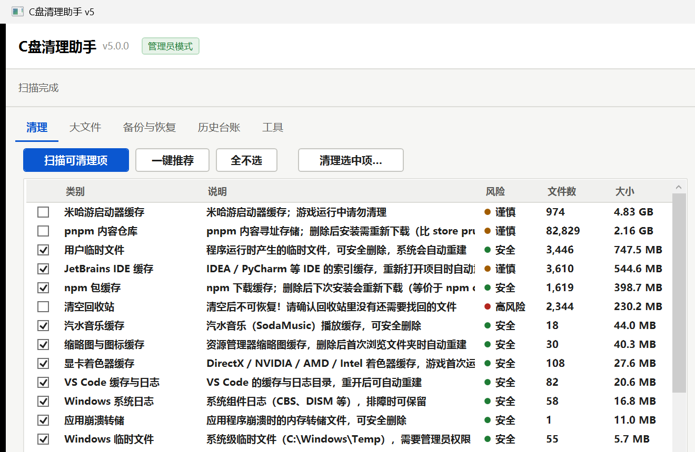
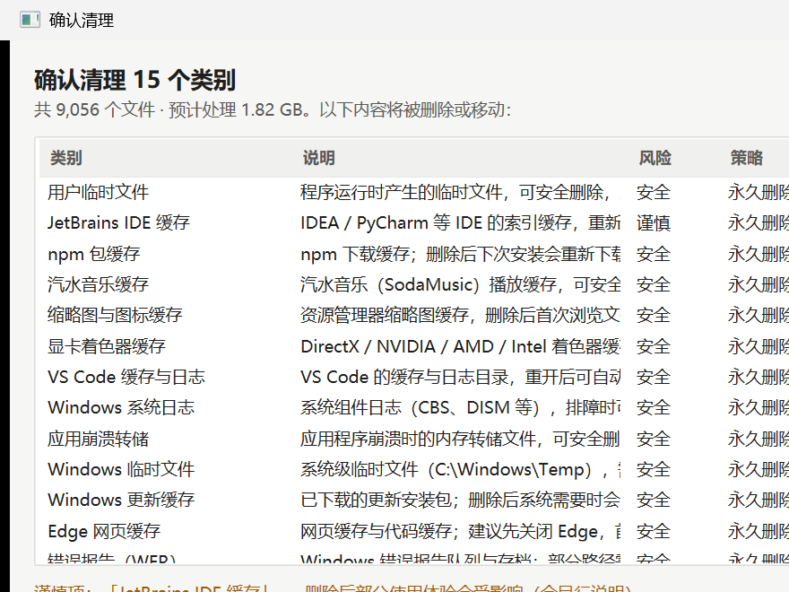
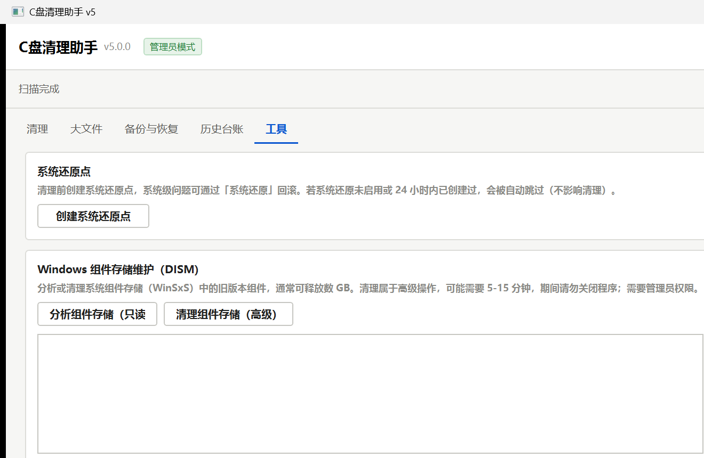

# C盘清理助手 v5.0

Windows C 盘清理工具：快、稳、安全、可追溯。基于 .NET 7 / WPF 重写，自包含发布（目标机免装 .NET），断网可用。

## 下载

前往 [Releases](https://github.com/zxiya-6/cdisk-cleaner/releases) 下载：

| 文件 | 说明 |
|---|---|
| `C盘清理助手_v5.0.0_安装包_x64.exe` | 标准安装程序（向导式安装；开始菜单/桌面快捷方式；含完整卸载） |
| `C盘清理助手_v5.0.0_便携版_x64.zip` | 免安装绿色版（解压即用，不写注册表） |

要求：Windows 10 / 11 x64；建议以管理员身份运行（覆盖系统级缓存类别）。

## 亮点

- **快**：全盘扫描 2 秒级（91,769 个文件实测 2.19 s；旧版 PowerShell 实现 15.86 s）
- **稳**：冷启动约 1.1 s；扫描内存峰值较旧版降低 40%；扫描与清理全程可取消、不假死
- **安全**：31 类清理规则；安全项默认勾选、高风险二次确认；执行期安全过滤器逐文件复核
- **可恢复**：标准 / 全部备份 / 全部永久删除三种清理方式；备份区随时一键恢复
- **可追溯**：操作台账记录每笔清理（时间/类别/数量/释放空间/结果），支持 CSV / HTML 导出
- **可扩展**：规则库 JSON 化，可在应用内在线更新（只下载不上传，旧版自动备份可回退）

## 截图





## 构建

环境：Windows + .NET SDK 7.0+（生成安装包另需 [Inno Setup 6](https://jrsoftware.org/isinfo.php)）

```powershell
dotnet build CleanMaster.sln -c Release

# 自包含发布
dotnet publish src\CleanMaster.App -c Release -r win-x64 --self-contained true -p:PublishReadyToRun=true -o publish\app
dotnet publish src\CleanMaster.Cli -c Release -r win-x64 --self-contained true -p:PublishReadyToRun=true -o publish\cli

# 生成安装包
powershell -ExecutionPolicy Bypass -File installer\build-installer.ps1 -SkipPublish
```

## 目录结构

```
src/        三工程源码（Core 引擎 / App 桌面端 / Cli 命令行）
rules/      清理规则库与安全保护名单
docs/       文档（使用说明 / 维护与交接手册 / 性能测试报告 / 能力对照清单 / 验证记录）
installer/  Inno Setup 安装包脚本与一键构建脚本
tests/      验收与维护脚本（自检 / 端到端 / 界面交互 / 性能基准 / 在线更新专项）
```

## 测试

```powershell
publish\cli\CleanMasterCli.exe selftest        # 内置自检 8 项
powershell -File tests\e2e-clean-test.ps1      # 端到端验收 11 项
powershell -File tests\uitest.ps1              # 界面交互 + 截图
```

> `tests\` 内脚本为构建机验收所用，含少量本机路径，按需修改即可复用。

## 数据与隐私

所有数据仅保存在本机 `%LOCALAPPDATA%\C盘清理助手`（配置 / 日志 / 台账 / 备份区），不上传任何数据；规则在线更新仅执行"下载"，安全保护名单不可被远程修改。

## 说明

本项目仅供学习与交流使用。清理操作前请留意应用内的预览与确认提示；高风险操作均有二次确认与备份/恢复路径。
